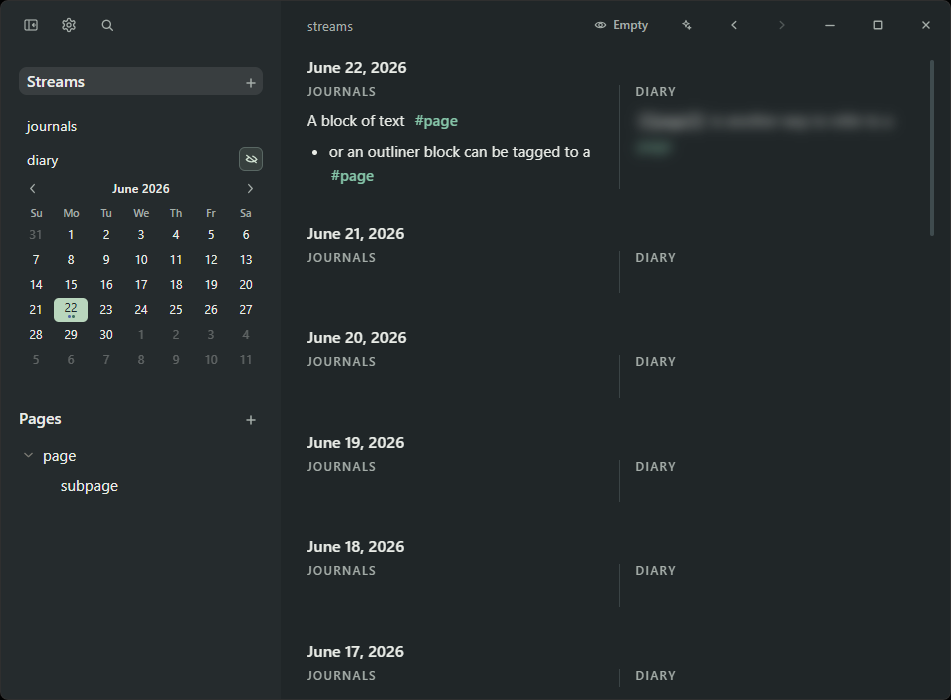
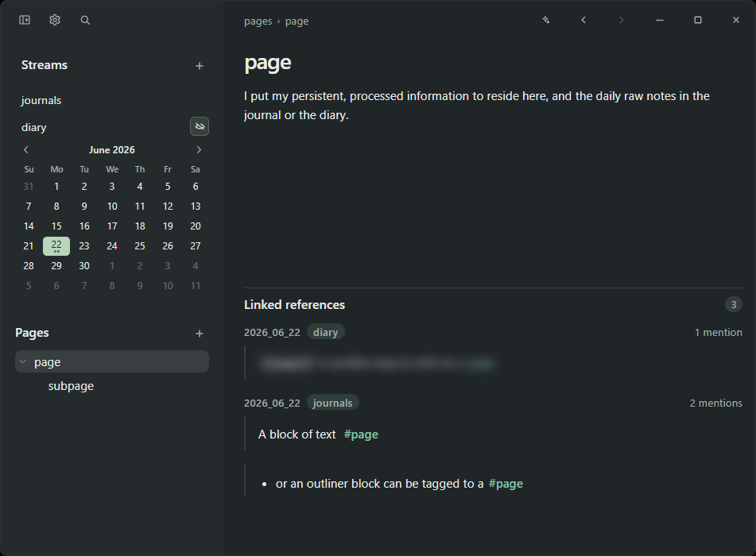
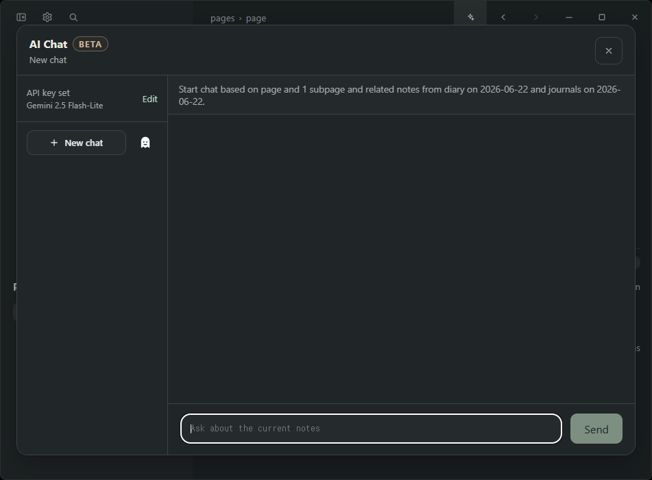
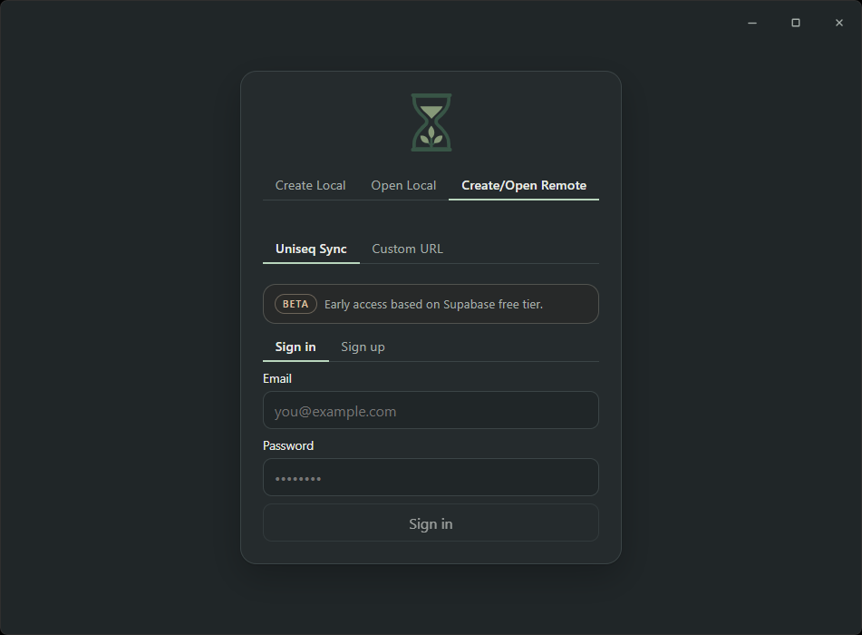

<p align="center">
  
</p>

<h1 align="center">Uniseq</h1>

<p align="center">
  A local-first, Markdown-native note app for fast capture and durable knowledge.
</p>

<p align="center">
  Streams for daily writing. Pages for long-term structure. Plain files as the source of truth.
</p>

## Screenshots

<table align="center" width="88%">
  <tr>
    <td align="center" width="50%"><strong>Streams</strong></td>
    <td align="center" width="50%"><strong>Pages</strong></td>
  </tr>
  <tr>
    <td align="center"></td>
    <td align="center"></td>
  </tr>
  <tr>
    <td align="center" width="50%"><strong>AI chat</strong></td>
    <td align="center" width="50%"><strong>Sync</strong></td>
  </tr>
  <tr>
    <td align="center"></td>
    <td align="center"></td>
  </tr>
</table>

## What Uniseq Is

Uniseq combines three ideas:

- Logseq-style daily capture
- Notion-style page hierarchy
- plain Markdown files as the permanent source of truth

It is built for people who want a personal knowledge app that stays close to the underlying folder, supports both streams and structured pages, and treats AI and sync as optional layers around the notes rather than the notes themselves.

## Why Uniseq Exists

I used Notion as my main note app, but I also kept a sticky note widget on my phone because it was the fastest place to capture thoughts. Over time, more and more notes piled up in the widget, and I had to periodically move them into Notion. That extra step became friction.

I later tried Logseq and liked its daily note workflow, especially how small pieces of writing could accumulate naturally under linked topics. But not long after, logseq announced diverging into a DB version that handles reference system better, in the cost of losing markdown nativeness. While trying to understand why the migration was necessary I realized that if we give up block-to-block references and just keep block-to-page references, we can keep things simple and lightweight while not losing much functionality, as not many people use manual block embeddings. Manual block embeds/tags requires giving every block a UUID which makes references complex and adds artifacts that go against markdown native spirit. So Uniseq only allows block-to-page tags, but not page-to-blocks, making references unidirectional, hence the name Uniseq.

That is the core of Uniseq:

- capture quickly on a time axis (streams)
- organize gradually on a structure axis (pages)
- keep everything in files you still own without the app

## Mental Model

### Streams

Streams are where your notes start.

By default there are two streams - journal and diary. You can use the journal for projects and ideas, diary for thoughts and reflection (diary streams come with a blur feature).

### Pages

Pages are for durable knowledge.

They are where notes become intentional, organized, and reusable. Use them for project docs, topic pages, reference material, wiki-like structures, and anything you expect to revisit over time.

### References

Pages and streams are meant to work together.

Capture something quickly in a stream, link it to a durable page, and let that page collect related mentions over time. In practice, the workflow is:

1. Write quickly in a stream.
2. Reference important topics with `[[Page/Subpage]]` or `#Page/Subpage`.
3. Revisit the linked page when the topic becomes worth organizing.
4. Promote stable ideas into pages and page hierarchies.

This keeps capture lightweight without giving up long-term structure.

## What Uniseq Is Good At

- fast daily note-taking
- building a personal wiki over time
- linking transient writing to durable topics
- keeping notes in plain Markdown files
- browsing by hierarchy, recency, references, and search
- separating different areas of life or work into distinct streams
- syncing a file-first workspace across devices
- using AI to talk with your own notes instead of a detached knowledge base

## Key Capabilities

- Local-first workspace with plain Markdown files
- Pages with hierarchy and linked-reference views
- Multiple date-based streams, including diary-specific privacy blur
- Mixed writing model: bullets when you want them, normal Markdown when you do not
- Search across page titles, page ids, and note content
- AI chat over your notes with saved chats and private in-memory chats
- Optional sync with conflict handling
- Desktop and mobile-oriented Tauri app shell

## Workspace Format

Uniseq is file-first by design. A workspace is just a folder with a few conventional roots:

```text
My Notes/
  pages/
    Projects.md
    Projects___Uniseq.md
    Writing___Ideas.md
  journals/
    2026_06_23.md
  diary/
    2026_06_23.md
  assets/
  uniseq/
```

Important details:

- `pages/` contains flat Markdown files. Hierarchy is encoded in filenames with `___`, so `pages/Projects___Uniseq.md` represents the page `Projects/Uniseq`.
- Streams live as top-level folders such as `journals/`, `diary/`, or any custom stream name you create. Each stream note is a dated Markdown file like `2026_06_23.md`.
- App state such as ordering and sync metadata lives under `uniseq/`.
- Notes stay readable and movable outside the app.

## AI and Sync

AI and sync are support layers, not the core product.

### AI chat

- AI chat works against your local notes.
- You bring your own Gemini API key in the app UI.
- Regular chats are stored locally.
- Private chats stay in memory only and do not enter saved chat history.

### Sync

- Sync is optional.
- The app can connect to the built-in Uniseq provider flow or a custom sync URL.
- Sync is file-by-file, local-first, and conflict-aware.
- The custom backend contract is documented in [SYNC_SERVICE.md](SYNC_SERVICE.md).
- There is also a backend smoke-test checklist in [SYNC_SERVICE_SMOKE_TEST.md](SYNC_SERVICE_SMOKE_TEST.md).

## Current Status

Uniseq is still early and personal-use-driven.

- The current tested path is Windows and Android.
- The codebase includes Tauri desktop/mobile targets, but macOS and iOS are not verified in practice here.
- The app is designed for single-user personal knowledge work, not real-time collaboration.
- The file model and sync contract are intentional parts of the project, not temporary implementation details.

## Build From Source

### Prerequisites

- Rust toolchain
- Node.js and npm
- Tauri 2 system prerequisites for your platform

### Run in development

```bash
npm --prefix web install
cargo tauri dev
```

Tauri uses the web app from `web/` and starts Vite automatically on port `1420`.

### Tests

```bash
cargo test
npm --prefix web test
```

### Production build

```bash
cargo tauri build
```

If you only want to build the web bundle:

```bash
npm --prefix web run build
```

If you want to use the built-in Uniseq account flow during development, the web app reads these optional environment variables from `web/.env`:

```env
VITE_SYNC_ROOT_PREFIX=
VITE_SUPABASE_URL=
VITE_SUPABASE_PUBLISHABLE_KEY=
```

For local-only use, or for custom sync backends where you paste a bearer token manually, those variables are not required.

## Contributing

Issues and pull requests are welcome, especially around:

- PDF and attachment support
- Windows and Android workflows
- mobile polish
- macOS and iOS validation
- sync backend compatibility
- Markdown and file-model edge cases

If you are proposing a larger change, the project bar is simple: preserve the file-first model, keep behavior legible, and make capture or retrieval meaningfully better.

## Non-Goals

Uniseq is not trying to be:

- a database-first workspace
- a cloud-first collaboration product
- a complex block-identity system
- an automation-heavy productivity platform
